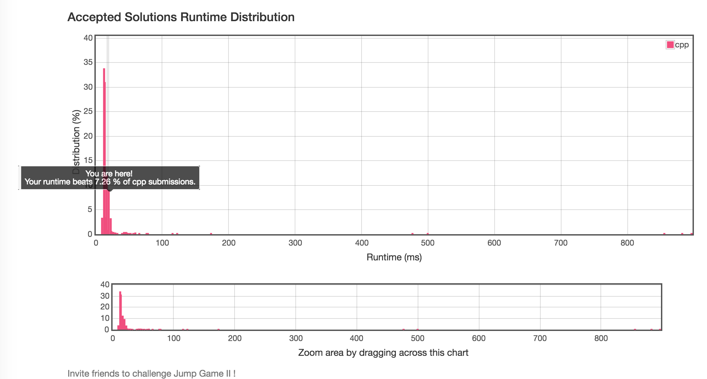

# 45 Jump Game II   
    Given an array of non-negative integers, you are initially positioned at the first index of the array.

    Each element in the array represents your maximum jump length at that position.

    Your goal is to reach the last index in the minimum number of jumps.

    For example:
    Given array A = [2,3,1,1,4]

    The minimum number of jumps to reach the last index is 2. (Jump 1 step from index 0 to 1, then 3 steps to the last index.)


数组中的元素值是代表一个范围区间，题目需要求的是最小跳跃次数，也就是每一次的跳跃覆盖的范围应该尽可能远，所以要选出该范围内每次能跳的最远的距离。

1-假设 [ start, end ] 表示第 i 次跳跃才能到达的区间，nextEnd 代表在该区间中起跳的下一个最远元素，那么，[ end+1, nextEnd ] 表示第 i+1 次跳才能去到的范围区间。  
2-初始化 [start , end] 为 [0,0]，重复执行上面操作，直到 [start, end] 覆盖到终点元素。由于 [start, end] 表示第 i  次跳跃才能到达的区间，所以 i 便是最小的跳跃次数。
在代码实现中， start  变量没有影响到程序的执行，加进去只是为了方便理解。


注意两点： 
<font color =#B8860B>  
1、当前位置的元素代表从当前能跳的最远距离  
2、每次应选出在当前区域[start,end]能跳到的最远距离  
3、前后两次跳是连续的 
</font>  

时间复杂度 :O（n）  
算法：BFS      



```cpp
//
//  main.cpp
//  20171128tmp
//
//  Created by Cookie on 2017/11/28.
//  Copyright © 2017年 Cookie. All rights reserved.
//

#include<iostream>
#include <vector>
#include <cmath>
using namespace std;

int jump(vector<int>& nums) {
    
    int start = 0;
    int end = 0;
    
    int cnt = 0;
    
    int nextEnd = 0;
    
    for (int i = 0 ; i < nums.size()-1; i++) {
        cout << "----------------------------" << endl;
        
        cout << "i:" << i << " start:"<< start << " end:" << end << " cnt:" << cnt << " nextEnd:" << nextEnd << endl;
        
        if (i > end) {  // 如果没有覆盖到终点元素，会返回错误码
            return -1;
        }
        
        nextEnd = max(nextEnd, i + nums[i]);  // 取[start,,end] 区间能跳到最远的位置
        if (i == end) {
            start = (i==0)?i:i+1 ;  // 不是在开头，就应该是从它的下一个开始
            end = nextEnd;
            cnt++;
        }
        cout << "i:" << i << " start:"<< start << " end:" << end << " cnt:" << cnt << " nextEnd:" << nextEnd << endl;
    }
    
    return cnt;
}

int main(int argc,char * argv[]){
    vector<int> vec{2,3,1,1,4};
    cout << jump(vec);
}
```
   
运行结果如下：  
  
```cpp
----------------------------
i:0 start:0 end:0 cnt:0 nextEnd:0
i:0 start:0 end:2 cnt:1 nextEnd:2    // 跳到下一个区间
----------------------------
i:1 start:0 end:2 cnt:1 nextEnd:2
i:1 start:0 end:2 cnt:1 nextEnd:4
----------------------------
i:2 start:0 end:2 cnt:1 nextEnd:4
i:2 start:3 end:4 cnt:2 nextEnd:4    // 跳到下一个区间
----------------------------
i:3 start:3 end:4 cnt:2 nextEnd:4
i:3 start:3 end:4 cnt:2 nextEnd:4
2

```


