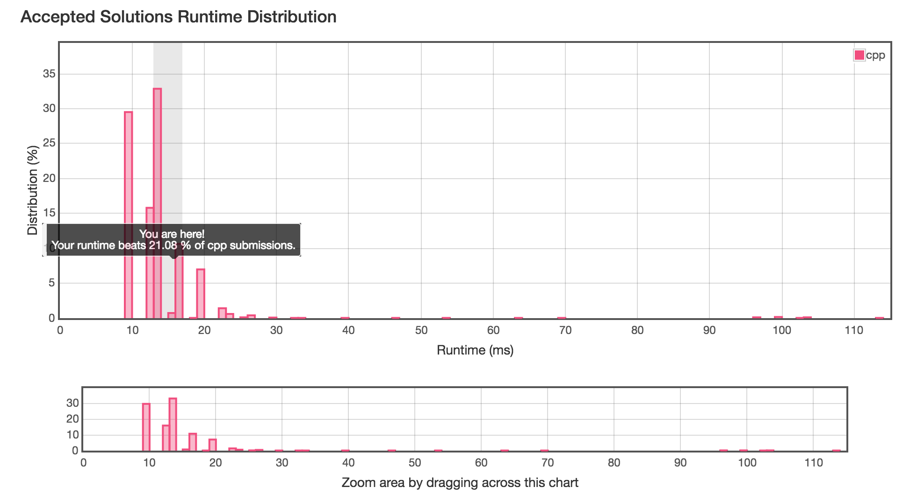

# 46. Permutations  
   Given a collection of distinct numbers, return all possible permutations.

For example,
`[1,2,3]` have the following permutations:

```
[
  [1,2,3],
  [1,3,2],
  [2,1,3],
  [2,3,1],
  [3,1,2],
  [3,2,1]
]
```

全排列是将一组数按一定顺序进行排列，如果这组数有n个，那么全排列数为n!个。现以{1, 2, 3, 4, 5}为例说明如何编写全排列的递归算法。  
1、首先看最后两个数4, 5。 它们的全排列为4 5和5 4, 即以4开头的5的全排列和以5开头的4的全排列。由于一个数的全排列就是其本身，从而得到以上结果。   
2、再看后三个数3, 4, 5。它们的全排列为3 4 5、3 5 4、 4 3 5、 4 5 3、 5 3 4、 5 4 3 六组数。即以3开头的和4,5的全排列的组合、以4开头的和3,5的全排列的组合和以5开头的和3,4的全排列的组合。  
       从而可以推断，设一组数p = {r1, r2, r3, ... ,rn}, 全排列为perm(p)，pn = p - {rn}。因此perm(p) = r1perm(p1), r2perm(p2), r3perm(p3), ... , rnperm(pn)。当n = 1时perm(p} = r1。为了更容易理解，将整组数中的所有的数分别与第一个数交换，这样就总是在处理后n-1个数的全排列。  
       
注意两点： 
<font color =#B8860B>  
1、每次都是取其中一个与第一个元素交换，然后剩下的quanpailie 	
2、分析如下：

```
[0 0] [1 1] 1 2 3  
	  [1 2] 1 3 2
	  
[0 1] [1 1] 2 1 3
      [1 2] 2 3 1
      
[0 2] [1 1] 3 2 1
      [1 2] 3 1 2	   
```
</font>  

时间复杂度 :O（n(n-1)!）  
算法：DFS     



```cpp
//
//  main.cpp
//  20171128tmp
//
//  Created by Cookie on 2017/11/28.
//  Copyright © 2017年 Cookie. All rights reserved.
//

#include<iostream>
#include <vector>
#include <cmath>
using namespace std;

void print_vec(vector<int>& nums){
    for( auto each : nums )
        cout <<each << " ";
    cout << endl;
}

void print_(const int num){
    for(int i=0; i< num;i++ )
        cout << "\t";
    for(int i=0; i< num;i++ )
        cout << "-";
}
class Solution {
public:
    vector<vector<int>> permute(vector<int>& nums) {
        vector<vector<int>> ret;
        permute(nums, 0, ret);
        return ret;
    }

    void permute(vector<int>& nums, int idx, vector<vector<int>>& ret) {
        static int loop = 0;            // loop variable to see the loop hierarchy
        print_(loop);
        cout << ":"<<loop <<" idx: " <<idx << endl;
        if (idx == nums.size() - 1) {
            print_(loop);
            cout << "程序的结果: " <<endl;
            print_(loop);
            print_vec(nums);

            ret.push_back(nums);
            return;
        }

        for (int i = idx; i < nums.size(); ++i) {
            if(!loop)           // loop is 0，最上层的递归，输出空行，好分析
                cout << endl;
            print_(loop);
            cout <<"迭代前 i:" << i <<" idx: " <<idx << endl;
            swap(nums[idx], nums[i]);
            print_(loop);
            cout << "swap(nums[" << idx<<"],nums[" << i <<"]);" <<" ";
            print_vec(nums);

            loop++;
            permute(nums, idx + 1, ret);
            loop--;

            print_(loop);
            cout <<"迭代后 i:" << i <<" idx: " <<idx << endl;

            swap(nums[i], nums[idx]);
            print_(loop);
            cout << "swap(nums[" << idx<<"],nums[" << i <<"]);" <<" ";
            print_vec(nums);
        }
    }
};

int main(int argc,char * argv[]){
    vector<int> vec{1,2,3};
    auto res = Solution().permute(vec);
    for(auto one:res ){
        for(auto o :one)
            cout << o << " ";
        cout << endl;
    }
}
```
   
运行结果如下：  
  
```cpp
:0 idx: 0

迭代前 i:0 idx: 0
swap(nums[0],nums[0]); 1 2 3 
	-:1 idx: 1
	-迭代前 i:1 idx: 1
	-swap(nums[1],nums[1]); 1 2 3 
		--:2 idx: 2
		--程序的结果: 
		--1 2 3 
	-迭代后 i:1 idx: 1
	-swap(nums[1],nums[1]); 1 2 3 
	-迭代前 i:2 idx: 1
	-swap(nums[1],nums[2]); 1 3 2 
		--:2 idx: 2
		--程序的结果: 
		--1 3 2 
	-迭代后 i:2 idx: 1
	-swap(nums[1],nums[2]); 1 2 3 
迭代后 i:0 idx: 0
swap(nums[0],nums[0]); 1 2 3 

迭代前 i:1 idx: 0
swap(nums[0],nums[1]); 2 1 3 
	-:1 idx: 1
	-迭代前 i:1 idx: 1
	-swap(nums[1],nums[1]); 2 1 3 
		--:2 idx: 2
		--程序的结果: 
		--2 1 3 
	-迭代后 i:1 idx: 1
	-swap(nums[1],nums[1]); 2 1 3 
	-迭代前 i:2 idx: 1
	-swap(nums[1],nums[2]); 2 3 1 
		--:2 idx: 2
		--程序的结果: 
		--2 3 1 
	-迭代后 i:2 idx: 1
	-swap(nums[1],nums[2]); 2 1 3 
迭代后 i:1 idx: 0
swap(nums[0],nums[1]); 1 2 3 

迭代前 i:2 idx: 0
swap(nums[0],nums[2]); 3 2 1 
	-:1 idx: 1
	-迭代前 i:1 idx: 1
	-swap(nums[1],nums[1]); 3 2 1 
		--:2 idx: 2
		--程序的结果: 
		--3 2 1 
	-迭代后 i:1 idx: 1
	-swap(nums[1],nums[1]); 3 2 1 
	-迭代前 i:2 idx: 1
	-swap(nums[1],nums[2]); 3 1 2 
		--:2 idx: 2
		--程序的结果: 
		--3 1 2 
	-迭代后 i:2 idx: 1
	-swap(nums[1],nums[2]); 3 2 1 
迭代后 i:2 idx: 0
swap(nums[0],nums[2]); 1 2 3 
1 2 3 
1 3 2 
2 1 3 
2 3 1 
3 2 1 
3 1 2 

```


